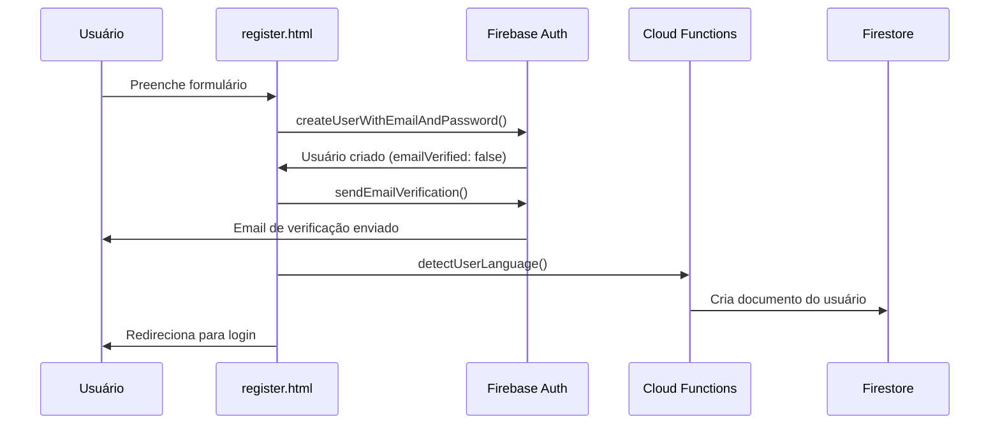
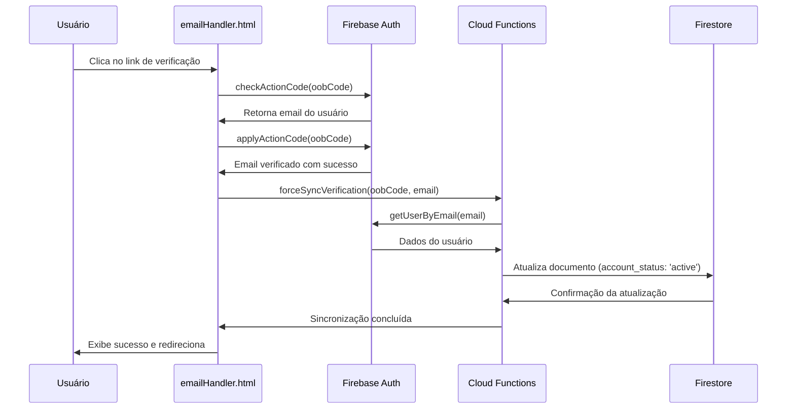

# Sistema de Login e Verificação de Email - Atalho

## Visão Geral

Este documento detalha o funcionamento completo do sistema de autenticação e verificação de email da aplicação Atalho, incluindo a sincronização entre Firebase Auth e Firestore.

## Arquitetura do Sistema

### Componentes Principais

1. **Frontend (Client-side)**
   - `login.html` - Interface de login
   - `emailHandler.html` - Processamento de verificação de email
   - `register.html` - Cadastro de usuários

2. **Backend (Firebase Functions)**
   - `functions/index.js` - Cloud Functions para sincronização
   - Firebase Auth - Autenticação de usuários
   - Firestore - Banco de dados para perfis de usuário

## Fluxo de Registro e Verificação

### 1. Registro de Usuário



### 2. Verificação de Email

O processo de verificação acontece quando o usuário clica no link enviado por email:

#### 2.1. Interceptação do Link (emailHandler.html)

```javascript
// Extração de parâmetros do link
const mode = getUrlParameter('mode');        // 'verifyEmail'
const oobCode = getUrlParameter('oobCode');  // Código de verificação
const continueUrl = getUrlParameter('continueUrl'); // URL de retorno
```

#### 2.2. Processo de Verificação



## Sincronização Firebase Auth ↔ Firestore

### Métodos de Sincronização

#### 1. Sincronização Automática (onDocumentUpdated)

```javascript
// functions/index.js - Trigger automático
exports.syncEmailVerificationStatus = onDocumentUpdated({
  document: "users/{userId}",
  region: "us-east1",
}, async (event) => {
  const before = event.data.before.data();
  const after = event.data.after.data();
  
  // Detecta mudança de email_verified: false → true
  if (before.email_verified === false && after.email_verified === true) {
    // Atualiza status para 'active'
    await userRef.update({
      account_status: "active",
      email_verified_at: new Date().toISOString(),
    });
  }
});
```

#### 2. Sincronização Manual (forceSyncEmailVerification)

Para usuários já autenticados:

```javascript
exports.forceSyncEmailVerification = onCall({
  region: "us-east1",
}, async (request) => {
  const uid = request.auth.uid;
  const userRecord = await auth.getUser(uid);
  
  // Atualiza Firestore com dados do Auth
  const updateData = {
    email_verified: userRecord.emailVerified,
    account_status: userRecord.emailVerified ? "active" : "pending_verification",
  };
  
  await userRef.update(updateData);
});
```

#### 3. Sincronização Pública (syncEmailVerificationPublic)

Para verificação sem autenticação (via oobCode):

```javascript
exports.syncEmailVerificationPublic = onRequest({
  region: "us-east1",
  cors: true,
}, async (request, response) => {
  const {oobCode, email} = request.body;
  
  // Busca usuário por email
  const userRecord = await auth.getUserByEmail(email);
  
  // Atualiza Firestore
  const updateData = {
    email_verified: userRecord.emailVerified,
    account_status: userRecord.emailVerified ? "active" : "pending_verification",
    sync_method: "public_oobcode",
  };
  
  await userRef.update(updateData);
});
```

## Fluxo de Login

### Validações no Login

```mermaid
flowchart TD
    A[Usuário submete login] --> B[Validar email/senha]
    B --> C[firebase.auth().signInWithEmailAndPassword()]
    C --> D{Email verificado?}
    D -->|Não| E[Logout imediato]
    E --> F[Exibir erro: Email não verificado]
    D -->|Sim| G[Login bem-sucedido]
    G --> H[Redirecionar para dashboard]
    F --> I[Orientar verificação]
```

### Código de Validação (login.html)

```javascript
async function login(email, password) {
  const userCredential = await firebase.auth().signInWithEmailAndPassword(email, password);
  const user = userCredential.user;
  
  // Verifica se o email foi verificado
  if (!user.emailVerified) {
    // Faz logout imediatamente
    await firebase.auth().signOut();
    
    throw new Error('Email não verificado! Você precisa verificar seu email antes de fazer login.');
  }
  
  return user;
}
```

## Estados da Conta

### Campos do Documento do Usuário (Firestore)

```javascript
{
  uid: "string",                    // ID único do Firebase Auth
  email: "string",                  // Email do usuário
  email_verified: boolean,          // Status de verificação
  account_status: "string",         // Estado da conta
  created_at: "ISO string",         // Data de criação
  email_verified_at: "ISO string",  // Data da verificação
  last_login: "ISO string",         // Último login
  updated_at: "ISO string",         // Última atualização
  sync_method: "string"             // Método de sincronização
}
```

### Possíveis Estados de `account_status`

- `pending_verification` - Aguardando verificação de email
- `active` - Conta ativa e verificada
- `suspended` - Conta suspensa
- `inactive` - Conta inativa

## Tratamento de Erros

### Erros Comuns e Soluções

#### 1. Email não verificado
```javascript
// login.html - Tratamento específico
if (!user.emailVerified) {
  await firebase.auth().signOut();
  throw new Error(`
    Email não verificado! 
    📧 Você precisa verificar seu email antes de fazer login.
    ✅ Verifique sua caixa de entrada (e spam)
  `);
}
```

#### 2. Link de verificação expirado
```javascript
// emailHandler.html - Tratamento de códigos inválidos
catch (error) {
  if (error.code === 'auth/invalid-action-code') {
    errorMessage = 'Link de verificação inválido ou expirado. Solicite um novo email de verificação.';
  } else if (error.code === 'auth/expired-action-code') {
    errorMessage = 'Link de verificação expirado. Solicite um novo email de verificação.';
  }
}
```

#### 3. Falhas de sincronização
```javascript
// Fallback para sincronização manual
if (syncResult && syncResult.success) {
  showStatus('success', 'Conta ativada com sucesso!');
} else {
  showStatus('success', 'Email verificado com sucesso!');
}
```

## Segurança

### Medidas Implementadas

1. **Verificação Obrigatória**: Login bloqueado até verificação de email
2. **Logout Automático**: Usuários não verificados são desconectados
3. **Validação Dupla**: Auth + Firestore para consistência
4. **CORS Configurado**: Proteção contra requisições não autorizadas
5. **Timeouts**: Links de verificação têm prazo de validade

### Headers de Segurança

```javascript
// _headers - Configurações de segurança
/*
  X-Frame-Options: DENY
  X-Content-Type-Options: nosniff
  Referrer-Policy: strict-origin-when-cross-origin
  Permissions-Policy: camera=(), microphone=(), geolocation=()
*/
```

## Monitoramento e Logs

### Logs Implementados

```javascript
// Exemplo de logging nas Cloud Functions
logger.info(`[Public Sync] Sincronizando via oobCode: ${oobCode}`);
logger.info(`[Public Sync] Usuário encontrado via email: ${userRecord.uid}`);
logger.error("[Public Sync] Erro na sincronização:", error);
```

### Métricas Importantes

- Taxa de verificação de email
- Tempo de sincronização
- Erros de autenticação
- Tentativas de login com email não verificado

## Melhorias Futuras

### Sugestões de Otimização

1. **Retry Automático**: Implementar retry para falhas de sincronização
2. **Cache**: Implementar cache para reduzir consultas ao Firestore
3. **Notificações**: Sistema de notificações para status da conta
4. **Analytics**: Métricas detalhadas de conversão
5. **Rate Limiting**: Proteção contra ataques de força bruta

### Escalabilidade

1. **Batching**: Agrupar operações de sincronização
2. **Queues**: Sistema de filas para operações assíncronas
3. **CDN**: Cache estático para assets
4. **Database Sharding**: Particionamento do Firestore

## Conclusão

O sistema implementa uma arquitetura robusta de autenticação com múltiplas camadas de validação e sincronização. A separação entre Firebase Auth (autenticação) e Firestore (dados do usuário) garante flexibilidade e consistência dos dados.

O fluxo de verificação de email é tratado de forma transparente para o usuário, com fallbacks e tratamento de erros abrangente. A sincronização automática e manual garante que os dados estejam sempre atualizados entre os serviços.

## Referências

- [Firebase Auth Documentation](https://firebase.google.com/docs/auth)
- [Firestore Documentation](https://firebase.google.com/docs/firestore)
- [Cloud Functions Documentation](https://firebase.google.com/docs/functions) 